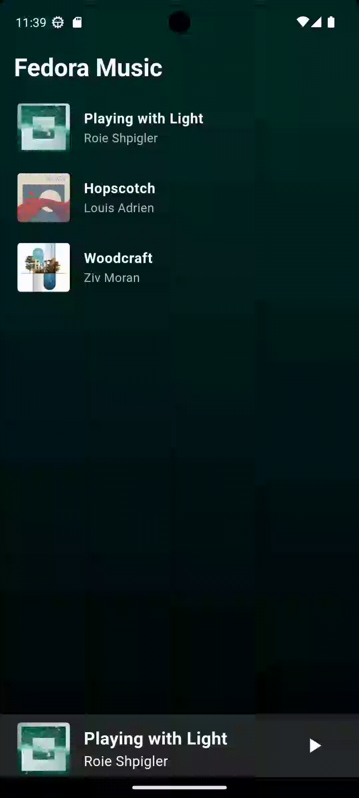

# Fedora

This is a music app (not yet finished).

Mainly hoping to learn the UI design and gesture animation effects of Youtube Music.

## Feature
 - State management uses provider.
 - Audio playback plugin uses Just_audio pub.

## Fedora UI

